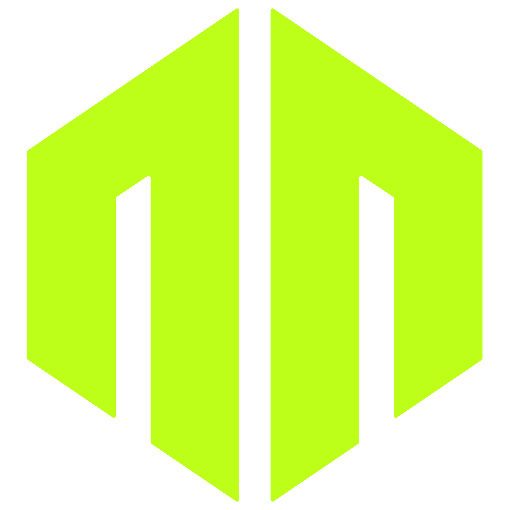

<div align="center">
  

# Mirror

A modular cross-platform tool platform. Every capability lives once, runs from any interface.


</div>

## Interfaces

- **CLI**: `mir-cli`, non-interactive, scriptable.
- **TUI**: `mir`, interactive terminal UI.
- **Bot**: Discord bot.

## Tools

- **password**: generator, strength checker, passphrase.
- **vault**: encrypted local credential store.
- **md**: markdown editing, export to PDF/HTML/PNG, import, themes.

## Getting started

Prerequisites: **Node.js 22+** and a **GitHub account** with access to this repository.

1. Create a [Personal Access Token (classic)](https://github.com/settings/tokens/new) with the `read:packages` scope.

2. Add it to your `~/.npmrc`:

```ini
//npm.pkg.github.com/:_authToken=YOUR_TOKEN
@nbenhadi:registry=https://npm.pkg.github.com
```

3. Install and run:

```bash
npm install -g @nbenhadi/mirror-tui
mir
```

## Documentation

- [CLI reference](docs/apps/cli.md)
- [TUI reference](docs/apps/tui.md)
- [Bot reference](docs/apps/bot.md)
- [Architecture](docs/architecture.md)
- [Development](docs/development.md)

## Contributing

See [CONTRIBUTING.md](CONTRIBUTING.md).

## Security

See [SECURITY.md](SECURITY.md).

## License

All rights reserved. See [LICENSE](LICENSE).
