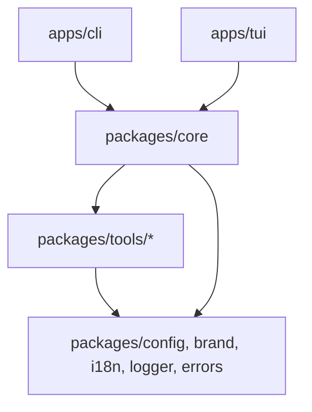
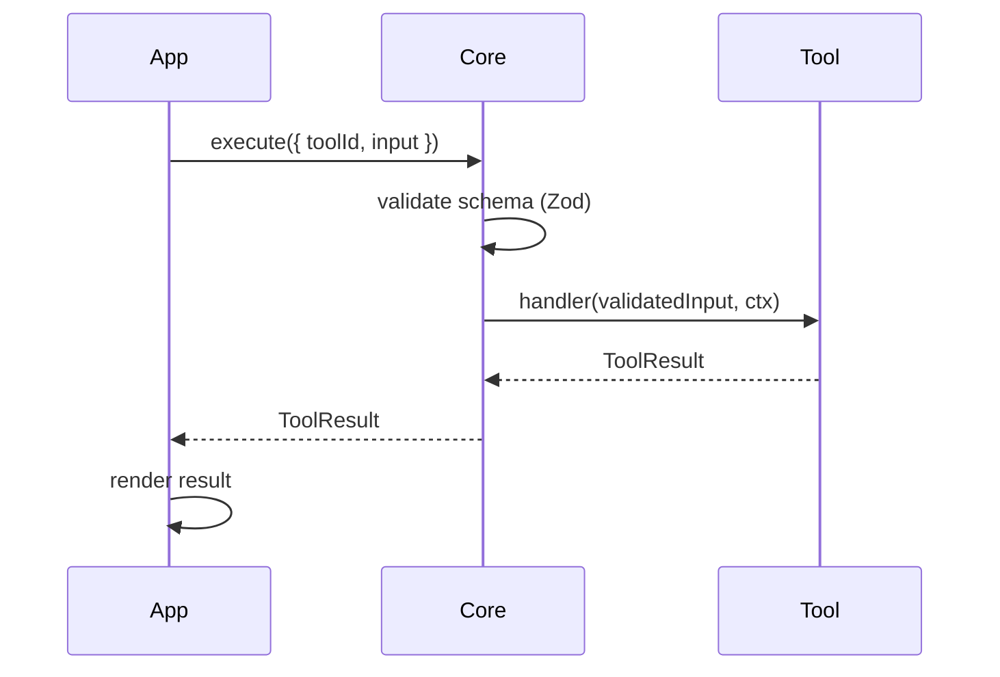

# Architecture

Mirror is a modular tool platform. Every tool is a self-contained package that can be invoked from any interface. Apps contain no business logic.

## Layers



The dependency rule is strict and one-directional: `apps` depend on `packages`, never the reverse. No circular dependencies.

## Execution flow

Every action in every app follows the same path:



Tools never throw. Every tool returns either `{ success: true, data }` or `{ success: false, error }`.

## Stack

| Layer      | Technology                   |
| ---------- | ---------------------------- |
| Language   | TypeScript (strict)          |
| Monorepo   | pnpm + Turborepo             |
| CLI        | Commander.js                 |
| TUI        | Ink (React in terminal)      |
| Validation | Zod                          |
| Crypto     | node:crypto + argon2         |
| Logs       | Pino                         |
| Tests      | Vitest + @vitest/coverage-v8 |
| Bundler    | tsup                         |
| Releases   | Changesets                   |

## Packages

```
packages/
  core/           Tool registry and execute() engine
  errors/         Shared typed error classes
  config/         App config schema, read/write, NodeEnv helpers
  brand/          Logo, colors, symbols
  i18n/           Translations (en, es, fr)
  logger/         Pino logger, environment-aware, with redact
  tools/
    password/     Password generator, strength checker, passphrase
    vault/        Encrypted local credential store
    settings/     App config read/write via tool interface
```

## Tool contract

A tool is a package that exports a `ToolDefinition`:

```typescript
interface ToolDefinition {
  id: string
  schema: ZodSchema // validates and types all actions
  handler: ToolHandler // (input, ctx) => Promise<ToolResult>
}
```

All actions for a tool are expressed as a discriminated union on `action` in the schema. One tool, multiple actions.

## Bundling

CLI and TUI use tsup with `noExternal: [/@nbenhadi\//]`. All workspace packages are bundled into the final binary. Published packages are fully self-contained. Internal packages are `private: true` and never published independently.
